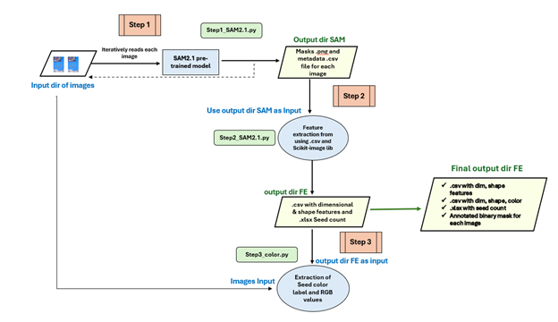

[version de ce document en français](./README-FR.md)  

[installation and usage instructions](/instructions.md)  

# Faba bean feature extraction pipeline from WGRF-faba bean images

## Overview

This work provides a workflow for running faba bean feature extraction pipeline to extract the dimensional, shape and color of faba bean seeds in the .csv file from the faba bean images. It presents a methodology for seed image segmentation and feature extraction using advanced deep learning and image processing techniques. The [Segment Anything Model 2.1](https://github.com/facebookresearch/sam2/blob/main/README.md) (SAM2.1) has been used for precise segmentation, while [OpenCV](https://docs.opencv.org/4.x/d7/dbd/group__imgproc.html), [Scikit-Image](https://scikit-image.org/), and [Matplotlib-colors](https://matplotlib.org/stable/gallery/color/named_colors.html) are employed to analyze the dimensional, spatial, shape, and color properties of segmented seeds. The pipeline also gives the seed count in an image and annotated binary images. The pipeline has been specifically developed based on the spatial coordinates of faba bean seeds, colorcard, label, ruler and coin.

### Faba bean Images

The images of faba beans were captured according to the Standard Operating Protocol (Figure 1).

Figure 1. Example of Faba bean images Vf1-1-2 (image shape=6000, 4000, 3) with faba bean seeds, colorcard, coin, label and ruler     

### Segmentanything 2.1 (MetaAI) Model used for image segmentation

[Segment Anything Model 2](https://ai.meta.com/sam2/) (SAM 2.1) is an advanced segmentation model designed to work seamlessly with both images and videos, treating a single image as a one-frame video. This work introduces a new task, model, and dataset aimed at improving segmentation performance. SAM 2 trained on SA-V dataset provides strong performance across a wide range of tasks. In image segmentation, SAM2 model is reported to be more accurate and 6 times faster than the Segment Anything Model (SAM). 

## 💡 Uniqueness/Novelty

The novelty of this work lies in the utilization of SegmentAnything 2.1 for image segmentation. While researchers have traditionally relied on OpenCV and scikit-image libraries for segmentation tasks, this study leverages SegmentAnything 2.1 to generate binary masks and metadata file which have been leveraged further for feature extraction from faba bean images. 

## 🔥 A Quick Overview

Figure 2: Flowchart for Faba bean feature extraction pipeline

## 📝 Details of Steps **(Figure 2)**:

1. **Step1:** Image/Images are used as input and SAM2.1 model generates the binary masks (.png) and metadata file (.csv) for each image in the Output dir SAM

2. **Step2:** The Output dir SAM (from Step2) is used as input for this step and data  analysis, feature extraction using sci-kit image library and feature engineering gives the .csv file with dimensional and shape features in another output dir FE

3. **Step3:** Both the output dir FE (from Step2) and the images (used as input in Step1) will be used as input for this step and the color labels and RGB values will be extracted using colormath library to give .csv file in the same Final output dir FE (from Step2).

## 📚 Final Output Files

After running the faba bean feature extraction pipeline, there will be 2 output directories-
1.	**Output dir SAM** will contain subfolders (Faba-Seed-CC_Vf_N-N_N) with masks (N.png) and metadata file (metadata.csv) for each image. 
2.	**Output dir FE** will contain :
a.	The .csv file of dimensional and shape features (Fava_bean_Features_extraction.csv)
b.	The .csv file of dimensional, shape, RGB values and Color names (FE_Color.csv)
c.	Seed Count (.xlsx) (Seed Count.xlsx)
d.	Annotated Binary image (.png) with contours around beans (Faba-Seed-CC_Vf_N-N_N_combined_mask.png) 

The features that have been extracted through this pipeline are:
1.	**Dimensional features (19)**: Area_mm2_SAM,Length_mm_SAM, Width_mm_SAM, perimeter_mm_SAM, centroid-0, centroid-1,  bbox-0, bbox-1, bbox-2, bbox-3, Area_pix_SAM, Eccentricity, equivalent_diameter_area, perimeter, solidity, area_convex, extent, Axis Major Length(pix)_SAM, Axis Minor Length(pix)_SAM, Aspect_Ratio, Roundness, Compactness, Circularity_SAM
2.	**Shape features (4)**: Shape, Shapefactor1, Shapefactor2, Shapefactor3, Shapefactor4
3.	**Color (2)**: RGB value, color_seeds
4.	**Seed count**: Number of seeds in image

## 🙏 Acknowledgements

We sincerely thank our mentors and collaborators at Agriculture and Agri-food Canada (AAFC) for their guidance, support, and invaluable insights throughout this project: Rodrigo Ortega Polo (Project Lead/Biology Study Leader-Bioinformatics), Nathaniel Lim (Acting Project Manager), Nicholas Larkan (Research Scientist), Etienne Low-Decarie (Manager, BICOE), Jackson Eyres (Team Lead-BICOE), Mathew Richards (Bioinformatics Programmer), Xiaohui Yang (Project Co-Lead), Harpreet Kaur Bargota (Bioinformatics Programmer Analyst/Biologist), Hao Nan Tobey Wang (Research Biologist), Parisa Daeijvad (Ph.D Research Student) and Trista Cormier (Research Assistant).

We also gratefully acknowledge the Western Grains Research Foundation (WGRF), Canada, for funding and supporting this work.

